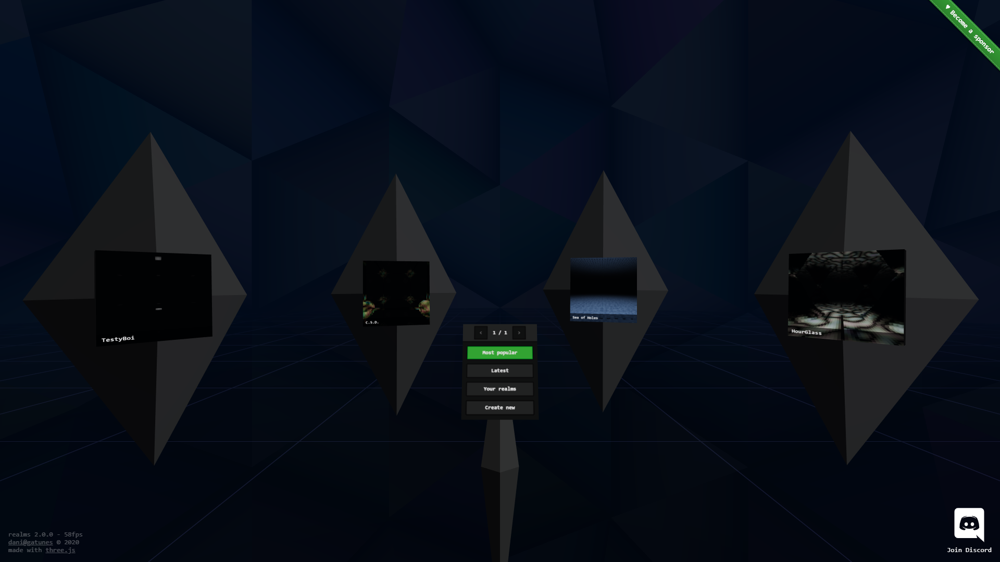

[Realms](https://realms.gatunes.com/)
==

[](https://realms.gatunes.com/)

> A second iteration of realmsvr

#### Live deployment

[https://realms.gatunes.com/](https://realms.gatunes.com/)


#### Local development

```bash
# clone this repo
git clone https://github.com/danielesteban/realms.git
cd realms/server
# install dependencies
npm install
# start the dev environment:
npm start
# open https://localhost:8080/ in your browser
```
